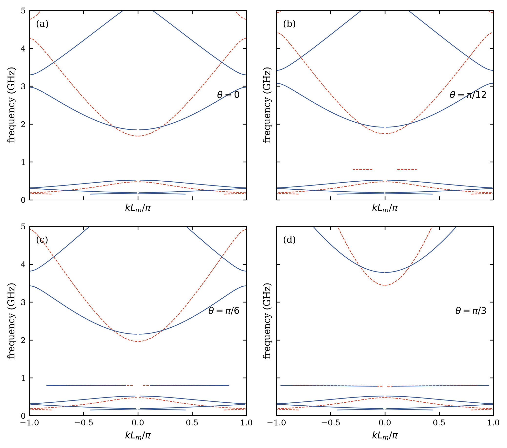
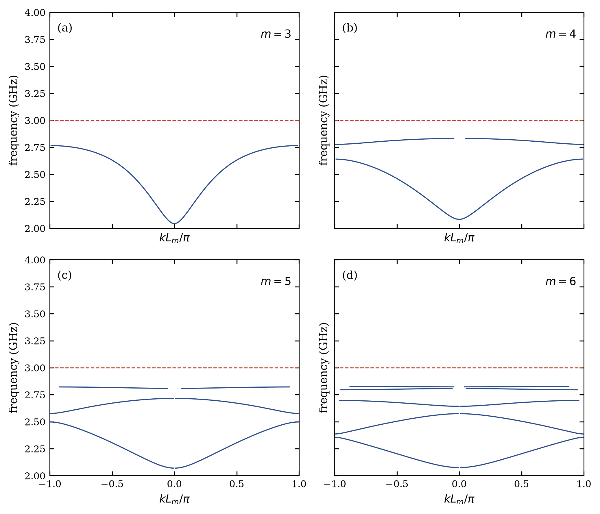
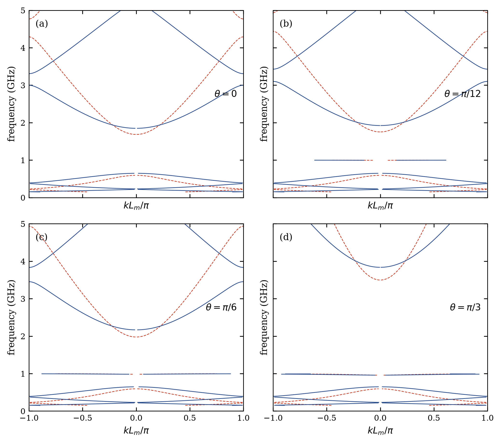
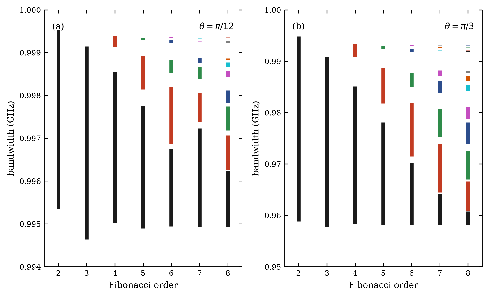
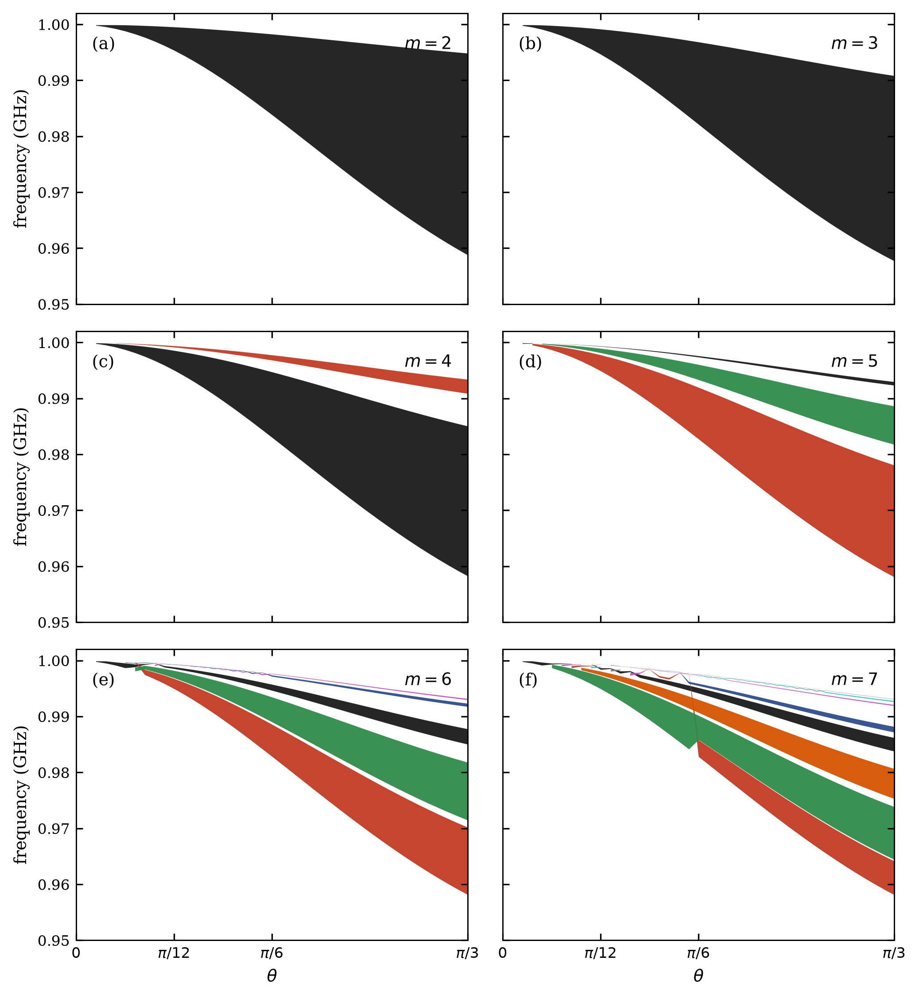

# Resultados obtenidos (reproducción del paper)

Reimplementación de Reyes-Gómez *et al.*, Phys. Rev. B **81**, 153101 (2010).
Todas las figuras se generaron con `python scripts/reproduce_figure_0N.py`
(sin edición manual de las imágenes).

Parámetros comunes del paper: \(a=b=12\,\mathrm{mm}\), \(\varepsilon_A=\mu_A=1\),
\(\varepsilon_0=\mu_0=1\), polarización **TE**.

---

## Resumen de concordancia

| Figura | Reproducida | Concordancia | Nota principal |
|--------|-------------|--------------|----------------|
| 1 | Sí | Buena | Sin gaps a \(\theta=0\) (impedancia adaptada si \(\omega_e=\omega_m\)) |
| 2 | Sí | Excelente | \(N_{\mathrm{modos}}=F_{m-2}=1,2,3,5\) exacto |
| 3 | Sí | Buena | \(\nu_m\) dentro del gap \(\langle n\rangle=0\) |
| 4 | Sí | Excelente | Anchos \(\sim 4.5\) y \(\sim 33\,\mathrm{MHz}\); crecen con \(\theta\) |
| 5 | Sí | Excelente | Splitting tipo Cantor; eje del PRB dice “bandwidth” pero son frecuencias |
| 6 | Sí (parámetros inferidos) | Buena | Caption original incompleto; regiones \(\nu(\theta)\) rellenas |

No se afirma coincidencia píxel a píxel: no hay vectorial digital del original.

---

## Figura 1 — Dispersión TE global

**Parámetros:** \(\nu_e=\nu_m=3\,\mathrm{GHz}\), \(S_3\) (discontinuo) y \(S_4\) (continuo),
\(\theta=0,\pi/12,\pi/6,\pi/3\).

**Qué se observa**

- A \(\theta=0\), \(\varepsilon_B=\mu_B\) implica adaptación de impedancia con el aire:
  no hay gaps (\(\lvert R\rvert\le 1\) en el barrido).
- El gap \(\langle n\rangle_m=0\) está *cerrado* en
  \(\nu=3\sqrt{F_{m-2}/F_m}\,\mathrm{GHz}\) (\(1.732\) para \(m=3\), \(1.897\) para \(m=4\)).
- A \(\theta\neq 0\) se abren gaps no Bragg y polaritónicos.

**Config:** `configs/figure_01.yaml` · **Script:** `scripts/reproduce_figure_01.py`



---

## Figura 2 — Subbandas cerca de \(\nu_m=3\,\mathrm{GHz}\)

**Parámetros:** mismos que Fig. 1; \(\theta=\pi/3\); ventana \(2\)–\(4\,\mathrm{GHz}\);
órdenes \(m=3,4,5,6\).

**Resultado clave:** el número de subbandas detectadas bajo \(\nu_m\) es exactamente
\(F_{m-2}\):

| \(m\) | Esperado \(F_{m-2}\) | Detectado | Intervalos (GHz, aprox.) |
|------:|---------------------:|----------:|--------------------------|
| 3 | 1 | 1 | \(2.044\)–\(2.766\) |
| 4 | 2 | 2 | \(2.083\)–\(2.641\); \(2.777\)–\(2.832\) |
| 5 | 3 | 3 | tres intervalos bajo 3 GHz |
| 6 | 5 | 5 | cinco intervalos bajo 3 GHz |

**Config:** `configs/figure_02.yaml` · **Script:** `scripts/reproduce_figure_02.py`



---

## Figura 3 — \(\nu_m\) dentro del gap \(\langle n\rangle=0\)

**Parámetros:** \(\nu_e=3\,\mathrm{GHz}\), \(\nu_m=1\,\mathrm{GHz}\); \(S_3\) y \(S_4\);
mismos ángulos que Fig. 1.

**Qué se observa**

- \(\nu_m=1\,\mathrm{GHz}\) cae en el gap de índice promedio nulo.
- A \(\theta=0\) no aparece polaritón plano en 1 GHz.
- A \(\theta\neq 0\) surge una banda casi plana (modos plasmon-polaritón), como en el original.

**Config:** `configs/figure_03.yaml` · **Script:** `scripts/reproduce_figure_03.py`



---

## Figura 4 — Zoom de polaritones

**Parámetros:** como Fig. 3; \(\theta=\pi/12\) y \(\pi/3\); ventanas estrechas alrededor de 1 GHz.

**Anchos de banda numéricos**

| \(m\) | \(\theta\) | Subbandas | \(\Delta\nu\) (GHz) |
|------:|------------|----------:|--------------------:|
| 3 | \(\pi/12\) | 1 | \(0.00451\) (\(\approx 4.5\,\mathrm{MHz}\)) |
| 3 | \(\pi/3\) | 1 | \(0.0331\) (\(\approx 33\,\mathrm{MHz}\)) |
| 4 | \(\pi/12\) | 2 | \(0.00354\) y \(0.00026\) |
| 4 | \(\pi/3\) | 2 | \(0.0268\) y \(0.00253\) |

El ancho crece con \(\theta\), en el mismo sentido que la lectura visual del impreso
(\(\sim 5\) y \(\sim 40\,\mathrm{MHz}\)).

**Config:** `configs/figure_04.yaml` · **Script:** `scripts/reproduce_figure_04.py`


---

## Figura 5 — Fragmentación vs orden de Fibonacci

**Parámetros:** \(\nu_e=3\), \(\nu_m=1\,\mathrm{GHz}\); \(m=2..8\); \(\theta=\pi/12\) y \(\pi/3\).

**Qué se observa**

- \(m=2\) y \(m=3\): un solo intervalo (\(F_0=F_1=1\)).
- A partir de \(m=4\): splitting sucesivo tipo Cantor con \(F_{m-2}\) subbandas.
- \(\theta=\pi/3\) ensancha el espectro respecto a \(\pi/12\).
- Los valores graficados (\(\approx 0.994\)–\(1.000\,\mathrm{GHz}\) y \(0.95\)–\(1.00\,\mathrm{GHz}\))
  son **frecuencias** de subbandas permitidas, no \(\Delta\nu\) (aunque el PRB rotula “bandwidth”).

**Config:** `configs/figure_05.yaml` · **Script:** `scripts/reproduce_figure_05.py`



---

## Figura 6 — Bandas vs ángulo

**Parámetros:** inferidos de Figs. 3–5 (`source: inferred_from_figures_3_to_5` en el YAML);
\(m=2..7\); \(\theta\) de \(0\) a \(\pi/3\).

**Qué se observa**

- No se grafica \(\Delta\nu(\theta)\) como líneas desde cero.
- Se rellena la región entre \(\nu_{\min}(\theta)\) y \(\nu_{\max}(\theta)\) de cada subbanda.
- A \(\theta=0\) las ramas colapsan hacia \(\nu_m=1\,\mathrm{GHz}\); al aumentar \(\theta\)
  se abren hacia abajo y se fragmentan según \(F_{m-2}\).

**Config:** `configs/figure_06.yaml` · **Script:** `scripts/reproduce_figure_06.py`



---

## Convergencia numérica

Modo \(m=3\), \(\theta=\pi/3\), ventana \(\approx 0.94\)–\(1.00\,\mathrm{GHz}\)
(`data/processed/convergence_figure04.json`):

| Puntos | \(\Delta\nu\) (GHz) |
|-------:|--------------------:|
| 500 | 0.03299 |
| 2000 | 0.03306 |
| 8000 | 0.03310 |
| 16000 | 0.03310 |

A partir de ~2000 puntos la variación del ancho es \(<0.2\%\). El recuento de modos es estable.
Usar \(c=3\times 10^8\,\mathrm{m/s}\) en lugar del valor SI cambia frecuencias en \(\sim 0.07\%\).

---

## Decisiones documentadas (no están en el paper)

| Tema | Decisión |
|------|----------|
| \(q\) | \(q=(\omega/c)\,n_A\sin\theta\) (restaurado vía EPL 2009) |
| \(c\) | \(299\,792\,458\,\mathrm{m/s}\) |
| Fig. 6 | \(m=2..7\) y mismos plasmas que Figs. 3–5 |
| Pérdidas | Ninguna (como el paper) |
| TM | No se grafica (el paper tampoco) |

---

## Cómo regenerar estos resultados

```bash
source .venv/bin/activate
pytest
python scripts/reproduce_all.py
```

Los PNG/SVG/PDF quedan en `figures/figure_0N/output/` y los resúmenes numéricos en
`figures/figure_0N/data/summary.json`.
