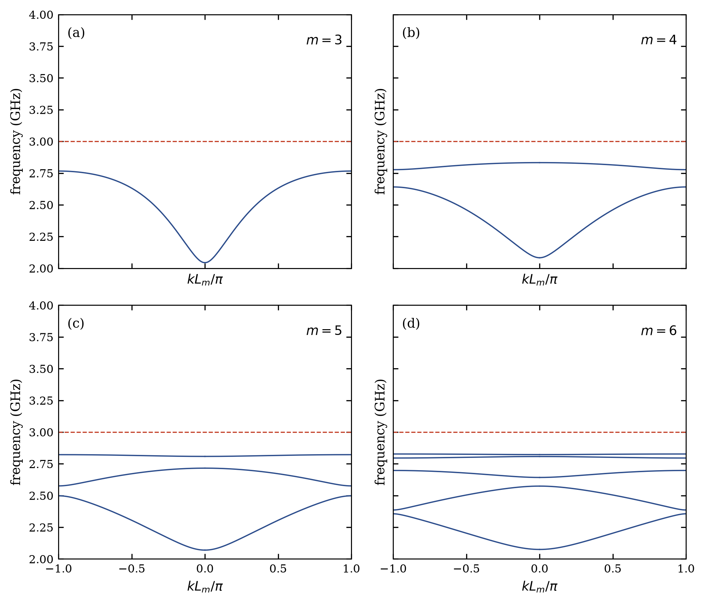
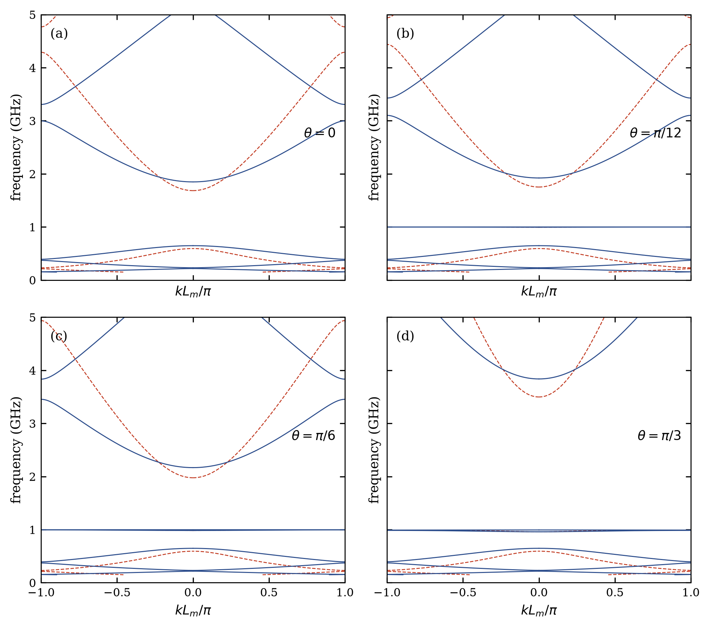
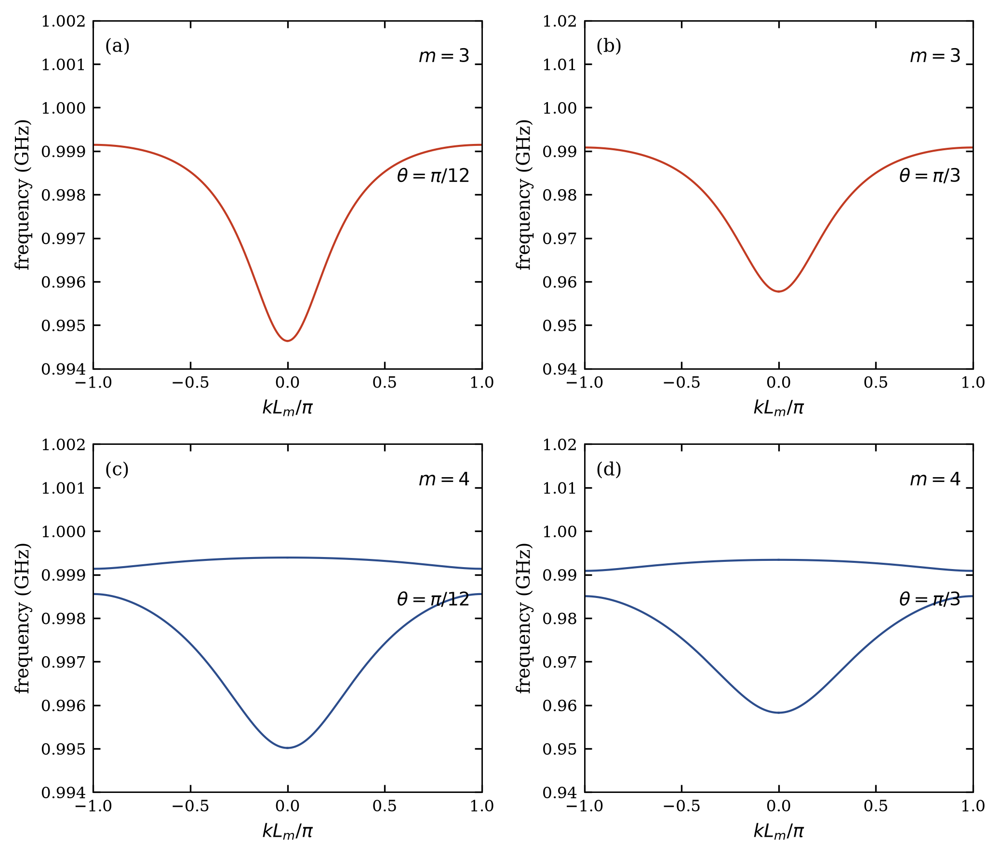
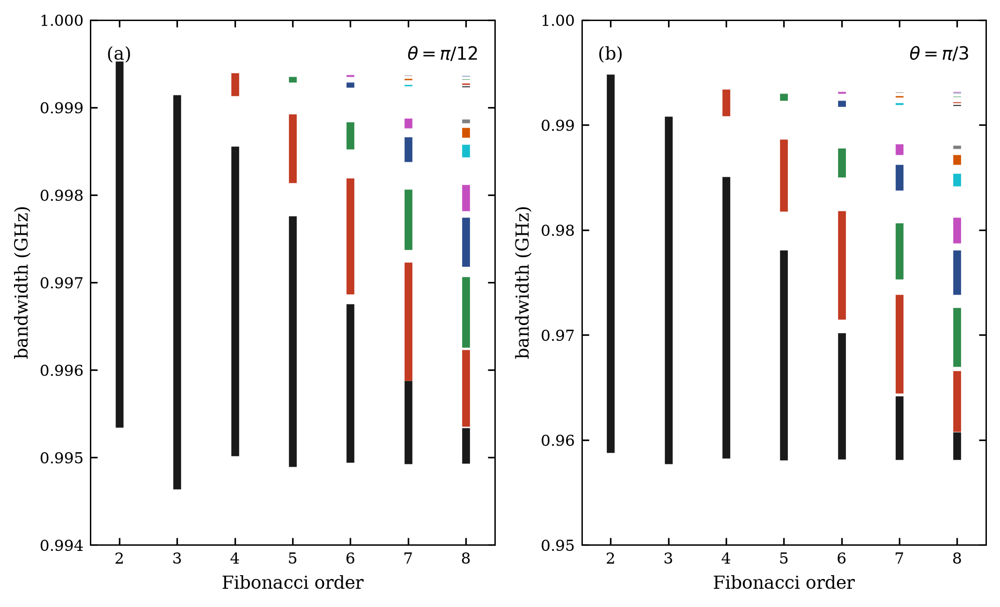
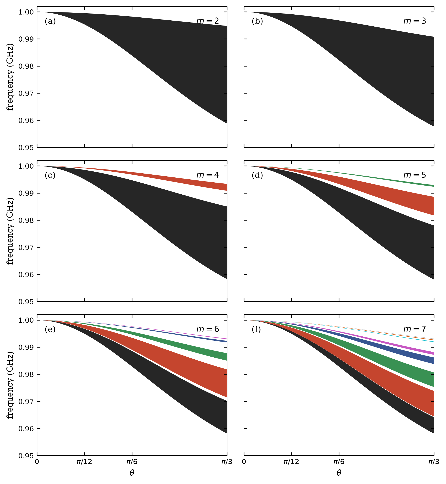

# Resultados y validación

Reimplementación de Reyes-Gómez *et al.*, Phys. Rev. B **81**, 153101 (2010),
por Emanuel Orozco Gallego. Todas las figuras salen de los scripts del
repositorio, sin edición manual; cada figura tiene su versión con la matriz de
transferencia (TMM), con ondas planas (PWE) y la superposición de las dos.

Parámetros comunes del paper: $a=b=12\,\mathrm{mm}$, $\varepsilon_A=\mu_A=1$,
$\varepsilon_0=\mu_0=1$, polarización **TE**. Los PDF que desarrollan estos
resultados están enlazados en el [README principal](../README.md#documentación-en-pdf).

---

## Resumen de concordancia con el paper

| Figura | Reproducida | Concordancia | Nota principal |
|--------|-------------|--------------|----------------|
| 1 | Sí | Buena | Sin gaps a $\theta=0$ (impedancia adaptada si $\omega_e=\omega_m$) |
| 2 | Sí | Excelente | $N_{\mathrm{modos}}=F_{m-2}=1,2,3,5$ exacto |
| 3 | Sí | Buena | $\nu_m$ dentro del gap $\langle n\rangle=0$; el original no marca la línea de 1 GHz |
| 4 | Sí | Excelente | Anchos $\sim 4.5$ y $\sim 33\,\mathrm{MHz}$; crecen con $\theta$ ($\sim 20\,\%$ frente a la lectura a ojo del impreso) |
| 5 | Sí | Excelente | Splitting tipo Cantor; el PRB rotula “bandwidth” pero son frecuencias |
| 6 | Sí (parámetros inferidos) | Buena | Caption original incompleto; regiones $\nu(\theta)$ rellenas |

No se afirma coincidencia píxel a píxel: no hay vectorial digital del original.

En cada figura, **Config** es la física común (`configs/physics/`) más la malla
de cada método (`configs/tmm/`, `configs/pwe/`).

---

## Figura 1: dispersión TE global

**Parámetros:** $\nu_e=\nu_m=3\,\mathrm{GHz}$, $S_3$ (discontinuo) y $S_4$ (continuo),
$\theta=0,\pi/12,\pi/6,\pi/3$.

- A $\theta=0$, $\varepsilon_B=\mu_B$ implica adaptación de impedancia con el aire:
  no hay gaps ($\lvert R\rvert\le 1$ en el barrido).
- El gap $\langle n\rangle_m=0$ está *cerrado* en
  $\nu=3\sqrt{F_{m-2}/F_m}\,\mathrm{GHz}$ ($1.732$ para $m=3$, $1.897$ para $m=4$).
- A $\theta\neq 0$ se abren gaps no Bragg y polaritónicos.

**Figuras:** [TMM](../results/tmm/figure_01/output/figure_01.pdf) ·
[PWE](../results/pwe/figure_01/output/figure_01.pdf) ·
[superposición](../results/comparison/figure_01/output/figure_01_overlay.pdf) ·
[error](../results/comparison/figure_01/output/figure_01_error.pdf) ·
config `figure_01.yaml` · script `scripts/tmm/figure_01.py`

---

## Figura 2: subbandas cerca de $\nu_m=3\,\mathrm{GHz}$

**Parámetros:** mismos que Fig. 1; $\theta=\pi/3$; ventana $2$–$4\,\mathrm{GHz}$;
órdenes $m=3,4,5,6$. El número de subbandas bajo $\nu_m$ es exactamente $F_{m-2}$:

| $m$ | Esperado $F_{m-2}$ | Detectado | Intervalos (GHz, aprox.) |
|----:|-------------------:|----------:|--------------------------|
| 3 | 1 | 1 | $2.044$–$2.766$ |
| 4 | 2 | 2 | $2.083$–$2.641$; $2.777$–$2.832$ |
| 5 | 3 | 3 | tres intervalos bajo 3 GHz |
| 6 | 5 | 5 | cinco intervalos bajo 3 GHz |

**Figuras:** [TMM](../results/tmm/figure_02/output/figure_02.pdf) ·
[PWE](../results/pwe/figure_02/output/figure_02.pdf) ·
[superposición](../results/comparison/figure_02/output/figure_02_overlay.pdf) ·
[error](../results/comparison/figure_02/output/figure_02_error.pdf) ·
config `figure_02.yaml` · script `scripts/tmm/figure_02.py`

---

## Figura 3: $\nu_m$ dentro del gap $\langle n\rangle=0$

**Parámetros:** $\nu_e=3\,\mathrm{GHz}$, $\nu_m=1\,\mathrm{GHz}$; $S_3$ y $S_4$;
mismos ángulos que Fig. 1.

- $\nu_m=1\,\mathrm{GHz}$ cae en el gap de índice promedio nulo.
- A $\theta=0$ no aparece polaritón plano en 1 GHz.
- A $\theta\neq 0$ surge una banda casi plana (modos plasmon-polaritón), como en el original.

**Figuras:** [TMM](../results/tmm/figure_03/output/figure_03.pdf) ·
[PWE](../results/pwe/figure_03/output/figure_03.pdf) ·
[superposición](../results/comparison/figure_03/output/figure_03_overlay.pdf) ·
[error](../results/comparison/figure_03/output/figure_03_error.pdf) ·
config `figure_03.yaml` · script `scripts/tmm/figure_03.py`

---

## Figura 4: zoom de polaritones

**Parámetros:** como Fig. 3; $\theta=\pi/12$ y $\pi/3$; ventanas estrechas alrededor de 1 GHz.

| $m$ | $\theta$ | Subbandas | $\Delta\nu$ (GHz) |
|----:|----------|----------:|------------------:|
| 3 | $\pi/12$ | 1 | $0.00451$ ($\approx 4.5\,\mathrm{MHz}$) |
| 3 | $\pi/3$ | 1 | $0.0331$ ($\approx 33\,\mathrm{MHz}$) |
| 4 | $\pi/12$ | 2 | $0.00354$ y $0.00026$ |
| 4 | $\pi/3$ | 2 | $0.0268$ y $0.00253$ |

El ancho crece con $\theta$, en el mismo sentido que la lectura visual del impreso
($\sim 5$ y $\sim 40\,\mathrm{MHz}$).

**Figuras:** [TMM](../results/tmm/figure_04/output/figure_04.pdf) ·
[PWE](../results/pwe/figure_04/output/figure_04.pdf) ·
[superposición](../results/comparison/figure_04/output/figure_04_overlay.pdf) ·
[error](../results/comparison/figure_04/output/figure_04_error.pdf) ·
config `figure_04.yaml` · script `scripts/tmm/figure_04.py`

---

## Figura 5: fragmentación frente al orden de Fibonacci

**Parámetros:** $\nu_e=3$, $\nu_m=1\,\mathrm{GHz}$; $m=2..8$; $\theta=\pi/12$ y $\pi/3$.

- $m=2$ y $m=3$: un solo intervalo ($F_0=F_1=1$).
- A partir de $m=4$: splitting sucesivo tipo Cantor con $F_{m-2}$ subbandas.
- $\theta=\pi/3$ ensancha el espectro respecto a $\pi/12$.
- Los valores graficados ($\approx 0.994$–$1.000\,\mathrm{GHz}$ y $0.95$–$1.00\,\mathrm{GHz}$)
  son **frecuencias** de subbandas permitidas, no $\Delta\nu$ (aunque el PRB rotula “bandwidth”).

**Figuras:** [TMM](../results/tmm/figure_05/output/figure_05.pdf) ·
[PWE](../results/pwe/figure_05/output/figure_05.pdf) ·
[comparación](../results/comparison/figure_05/output/figure_05_comparison.pdf) ·
config `figure_05.yaml` · script `scripts/tmm/figure_05.py`

---

## Figura 6: bandas frente al ángulo

**Parámetros:** inferidos de Figs. 3–5 (`source: inferred_from_figures_3_to_5` en el YAML);
$m=2..7$; $\theta$ de $0$ a $\pi/3$.

- Se rellena la región entre $\nu_{\min}(\theta)$ y $\nu_{\max}(\theta)$ de cada subbanda
  (no se grafica $\Delta\nu(\theta)$ como líneas desde cero).
- A $\theta=0$ las ramas colapsan hacia $\nu_m=1\,\mathrm{GHz}$; al aumentar $\theta$
  se abren hacia abajo y se fragmentan según $F_{m-2}$.
- Para todo $\theta>0$ hay exactamente $F_{m-2}$ subbandas ($1,1,2,3,5,8$), cada una
  con un color fijo de abajo hacia arriba: negro, rojo, verde, azul, magenta, cian.
- La malla en $\nu$ combina puntos logarítmicos junto a $\nu_m$ y una malla uniforme
  de $0.2\,\mathrm{kHz}$: a ángulos pequeños hay subbandas de apenas
  $\sim 50\,\mathrm{Hz}$ de ancho y, cerca de $\pi/12$, gaps físicos de $0.4\,\mathrm{kHz}$.

**Figuras:** [TMM](../results/tmm/figure_06/output/figure_06.pdf) ·
[PWE](../results/pwe/figure_06/output/figure_06.pdf) ·
[superposición](../results/comparison/figure_06/output/figure_06_overlay.pdf) ·
[error de bordes](../results/comparison/figure_06/output/figure_06_edge_error.pdf) ·
config `figure_06.yaml` · script `scripts/tmm/figure_06.py`

---

## Comparación TMM frente a PWE

Las superposiciones dibujan la figura de la TMM con trazo ancho y claro, y encima
la del PWE con trazo fino; las dos se cierran en los bordes exactos de banda
($\lvert R\rvert=1$, refinados con Brent). En las Figs. 5–6 las barras de la TMM
llevan al lado las del PWE. Detalle en
[comparacion_tmm_pwe.pdf](comparacion_tmm_pwe/comparacion_tmm_pwe.pdf); datos en
`results/comparison/summary.json`.

| Figura | $\max\lvert\Delta R\rvert$ en bandas | Acuerdo banda/gap | $\max\lvert\Delta\nu_{\mathrm{borde}}\rvert$ (GHz) |
|-------:|-----------------:|------------------:|-----------------:|
| 1 | $1.9\times10^{-2}$ | 0.99933 | $7.7\times10^{-5}$ |
| 2 | $1.4\times10^{-3}$ | 1 | $2.6\times10^{-6}$ |
| 3 | $4.5\times10^{-4}$ | 0.99933 | $1.1\times10^{-5}$ |
| 4 | $5.2\times10^{-5}$ | 1 | $1.2\times10^{-8}$ |

- El error de semitraza es de $10^{-7}$–$10^{-5}$ en casi todo el rango; el máximo
  de la Fig. 1 está en el extremo de 0.15 GHz, donde $\varepsilon_B=\mu_B\approx-399$.
- La única diferencia en el número de bordes (Fig. 1, $m=4$, $\theta=\pi/12$) es un
  gap de $1.5\times10^{-5}\,\mathrm{GHz}$ en 0.159 GHz que la TMM resuelve y el PWE
  ve como una punta que toca $\lvert R\rvert=1$.
- Fig. 5: error relativo de ancho máximo $4.1\times10^{-6}$; conteos iguales.
- Fig. 6: error de borde máximo $9.7\times10^{-8}\,\mathrm{GHz}$; conteos iguales.
- El número de subbandas es $F_{m-2}$ con los dos métodos.

**Costo** (un núcleo, [eficiencia](../results/comparison/efficiency/output/efficiency.pdf),
[tiempos](../results/comparison/timing/output/timing.pdf)):

- Las seis figuras cuestan 0.31 s con la TMM y ≈5.2 h con el PWE, entre $3\times10^4$ y
  $3\times10^5$ veces más por figura.
- El PWE crece como $N^{2.6}$ con $N=2hF_m+1$ (35.2 s por frecuencia con $m=10$). La TMM por
  recurrencia tarda 0.2–0.3 µs por frecuencia hasta $m=20$.
- Para un error de $10^{-6}$, el PWE necesita 1.1 s por frecuencia; la TMM llega a
  $3\times10^{-15}$ en microsegundos.
- Las cifras exactas de la última corrida están en
  `results/comparison/tables/efficiency_macros.tex`, de donde las toman los PDF.

**Método óptimo: la TMM.** Es exacta, su costo es $O(m)$ frente a $O(N^3)$ y es estable
junto a $\nu_m$. El PWE queda como verificación independiente y como base para cristales 2D.

Estudios propios del PWE: [bandas del libro](../results/pwe/book_benchmark/output/band_structure.pdf),
[celda de Fourier](../results/pwe/cell_fourier/output/cell_fourier.pdf),
[contaminación espectral](../results/pwe/spectral_pollution/output/spectral_pollution.pdf),
[convergencia con Drude](../results/pwe/convergence/output/drude_convergence.pdf),
[validez cerca de $\nu_m$](../results/pwe/convergence/output/validity_near_nu_m.pdf).

---

## Convergencia de la TMM

Modo $m=3$, $\theta=\pi/3$, ventana $\approx 0.94$–$1.00\,\mathrm{GHz}$
(`results/tmm/convergence/convergence_figure04.json`):

| Puntos | $\Delta\nu$ (GHz) |
|-------:|------------------:|
| 500 | 0.03299 |
| 2000 | 0.03306 |
| 8000 | 0.03310 |
| 16000 | 0.03310 |

A partir de ~2000 puntos la variación del ancho es $<0.2\%$ y el recuento de modos es
estable. Usar $c=3\times 10^8\,\mathrm{m/s}$ en lugar del valor SI cambia las
frecuencias en $\sim 0.07\%$.

---

## Correcciones visuales respecto a una primera versión

- **Fig. 1:** `plot()` unía puntos consecutivos en $\omega$ y cruzaba la zona de
  Brillouin con rectas, lo que manchaba el panel a baja frecuencia. Ahora cada rama
  se corta en los saltos de $k$ y se cierra en los bordes exactos de banda.
- **Fig. 6:** la primera versión dibujaba $\Delta\nu(\theta)$ como líneas desde 0. El
  original son seis paneles de regiones rellenas de frecuencia frente a $\theta$, que
  nacen en $\nu_m=1$ GHz a $\theta=0$ y se abren hacia abajo.

---

## Decisiones documentadas (no están en el paper)

| Tema | Decisión |
|------|----------|
| $q$ | $q=(\omega/c)\,n_A\sin\theta$ (restaurado vía EPL 2009) |
| $c$ | $299\,792\,458\,\mathrm{m/s}$ |
| Fig. 6 | $m=2..7$ y mismos plasmas que Figs. 3–5 |
| Pérdidas | Ninguna (como el paper) |
| TM | No se grafica (el paper tampoco) |

La justificación de cada decisión está en la [auditoría matemática](auditoria_matematica.md).

---

## Entorno de validación

- Python 3.14.6; numpy 2.5.2, scipy 1.18.1, matplotlib 3.11.1, pyyaml 6.0.3,
  pydantic 2.13.5, pytest 9.1.1.
- Tolerancia de banda: $\lvert R\rvert \le 1 + 10^{-12}$.
- Resolución de la TMM: 12000 puntos en 0.15–5 GHz (Fig. 1) y 16000 por ventana (Fig. 4);
  todas las mallas están en `configs/tmm/`.
- Pruebas: 323 pasan y 3 se omiten (identidades de Fibonacci con $k>m$).
- `make verify` comprueba las salidas, los criterios de acuerdo TMM/PWE y que cada PDF
  esté al día; con `--reference DIR` compara además los datos con una corrida anterior.
